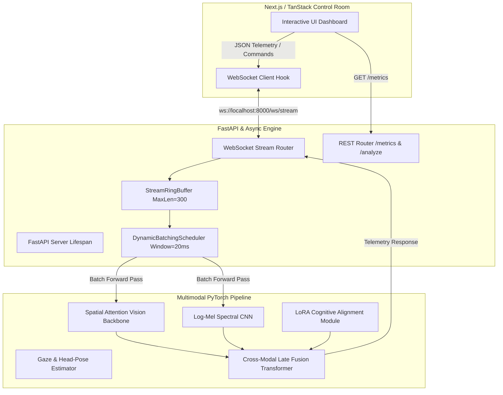

# Aegis-MM Architectural Specification & Mathematical Foundation

This document outlines the architectural specifications, mathematical equations, and tensor data-flow diagrams governing the Aegis-MM real-time multimodal guardrail platform.

---

## 1. System Architecture Diagram

---

## 2. Mathematical Foundations

### 2.1 Low-Rank Adaptation (LoRA) for Cognitive Alignment

Standard parameter fine-tuning modifies the full weight matrix $W_0 \in \mathbb{R}^{d \times k}$. In Aegis-MM fine-tuning and cognitive fluency evaluation, weight updates $\Delta W$ are constrained by low-rank decomposition matrices $A \in \mathbb{R}^{r \times k}$ and $B \in \mathbb{R}^{d \times r}$ where rank $r \ll \min(d, k)$:

$$h = W_0 x + \Delta W x = W_0 x + \frac{\alpha}{r} B A x$$

Where $\alpha$ represents the constant scaling factor. When zero-latency execution is required during production deployment, weights are fused via weight merging:

$$W_{\text{merged}} = W_0 + \frac{\alpha}{r} (B A)$$

### 2.2 Acoustic Log-Mel Spectrogram Extraction

For audio deepfake detection, raw acoustic waveforms $x(n)$ sampled at $f_s = 16,000 \text{ Hz}$ are segmented into overlapping frames and transformed via Short-Time Fourier Transform (STFT):

$$X(t, f) = \sum_{n=0}^{N-1} x(n + tH) w(n) e^{-j \frac{2\pi f n}{N}}$$

Where $w(n)$ represents a Hann window of length $N$ and hop size $H$. Filterbank energies are mapped onto the perceptual Mel scale:

$$m = 2595 \log_{10} \left( 1 + \frac{f}{700} \right)$$

Logarithmic compression is applied to produce 64-channel feature representations $S(t, m) = \log(1 + |X(t, m)|^2)$, isolating high-frequency vocoder artifacts common in TTS voice cloning.

### 2.3 Bidirectional Cross-Modal Attention

In the Late-Fusion Transformer (`src/fusion`), visual embeddings $V \in \mathbb{R}^{B \times T \times D_v}$ and acoustic embeddings $A \in \mathbb{R}^{B \times T \times D_a}$ are projected into a common subspace of dimension $d_k$. Cross-attention matrices compute synchronization alignment:

$$\text{Attention}(Q_v, K_a, V_a) = \text{softmax} \left( \frac{Q_v K_a^T}{\sqrt{d_k}} \right) V_a$$

Temporal divergence between $Q_v K_a^T$ and $Q_a K_v^T$ establishes the audio-visual lip-sync discrepancy index $\delta_{\text{sync}} \in [0, 1]$.

### 2.4 Symmetric Uniform Post-Training Quantization (PTQ)

To optimize memory footprint and edge inference latency, full-precision weights $W \in \mathbb{R}^{N \times M}$ are mapped to $b$-bit integer representations ($b \in \{4, 8\}$):

$$s = \frac{\max(|W|)}{2^{b-1} - 1}$$

$$W_q = \text{clip} \left( \left\lfloor \frac{W}{s} \right\rceil, -2^{b-1}, 2^{b-1} - 1 \right)$$

$$\hat{W} = s \cdot W_q$$

Where $\hat{W}$ represents the de-quantized approximation utilized during matrix multiplication.

---

## 3. Concurrency & SLA Management Engine

The asynchronous engine guarantees deterministic throughput via two decoupled mechanisms:

1. **Sliding Window Ring Buffer (`StreamRingBuffer`)**: Implements thread-safe circular storage backed by `collections.deque(maxlen=300)`. Oldest packets are automatically evicted in $O(1)$ time complexity when buffer occupancy exceeds 300 frames (10 seconds of 30 FPS history).
2. **Dynamic Request Batching (`DynamicBatchingScheduler`)**: Ingests single frame analysis requests from concurrent WebSocket clients into an `asyncio.Queue`. A background coroutine aggregates requests arriving within a micro-batch window ($\tau = 20 \text{ ms}$) up to maximum batch size $B_{\max} = 16$. This maximizes GPU/CPU tensor core saturation while preserving sub-50ms SLA execution guarantees across up to 16 simultaneous sessions.
